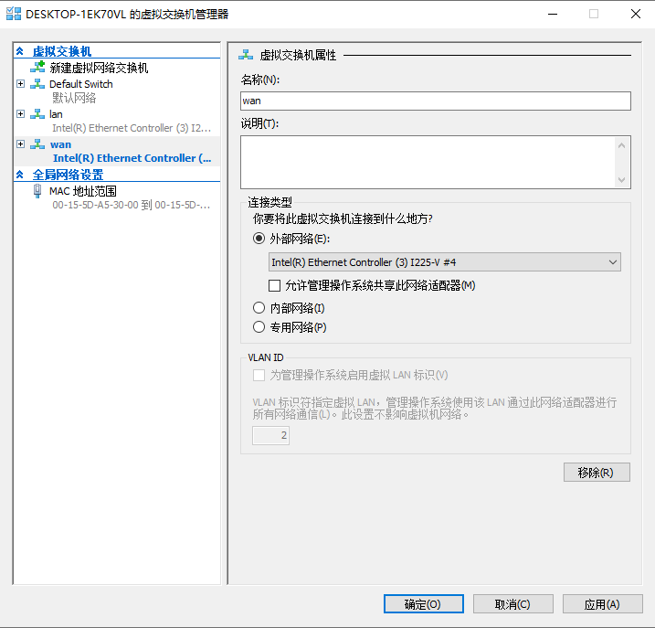
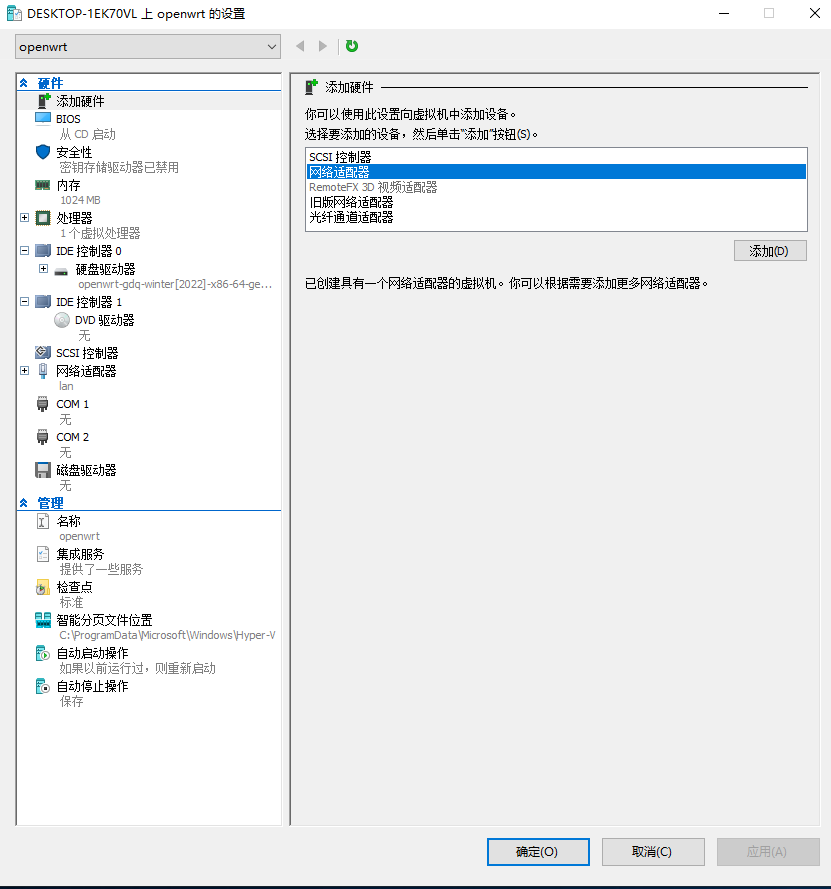
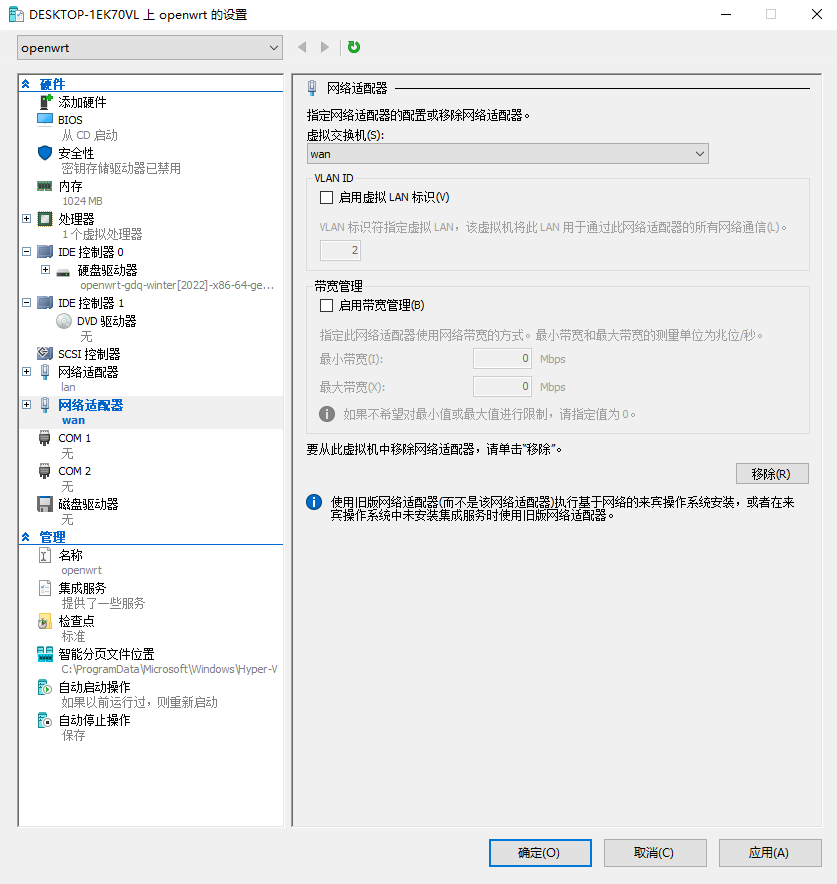
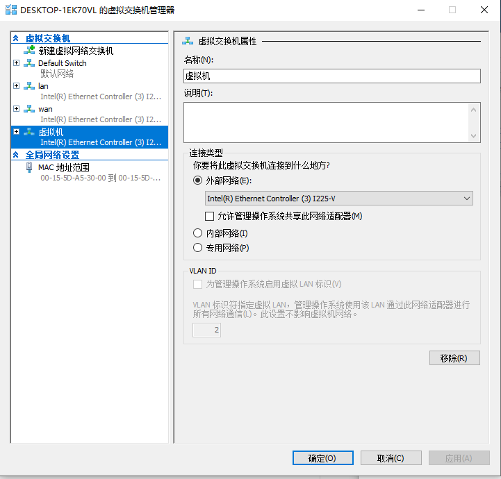

## 此教程为在一台四网口小主机上, 也可在普通家庭电脑上, 实现以下几个可选或必选功能
- 实现windows作为电视机顶盒htpc, 下载器, 蓝光播放机, 网路播放器(网页会员看视频网站)(必选)
- 内部实现一个openwrt作为主路由器(可选)
- 内部再实现一个Ubuntu等linux的服务器, 用于跑一些比较常见的服务, 比如自动的京东签到和京东领券(可选)

## 条件
1. 必须为一个内存大于4G的机器, 最好四核起步
2. 如果需要openwrt作为主路由器, 最好为3个网口起步;如果openwrt作为旁路由, 也可以两个网口, 但这次不做讨论
3. 硬盘最高大于60G, 防止硬盘不够用的情况

## 具体情况, 看完以后决定继不继续往下看
1. 如果机器4个网口或更多, 这里全部功能都可实现
2. 如果机器3个网口
  - openwrt科学上网;htpc
  - 服务器;htpc
  - openwrt旁路由(此教程openwrt安装不适用);服务器以及htpc
  - openwrt科学上网;htpc(网口和服务器公用, 此教程服务器安装不适用);服务器.不建议, 网口桥接影响cpu性能, 导致openwrt跑不满速度
3. 如果机器2个网口
  - openwrt旁路由(此教程openwrt安装不适用);htpc
  - 服务器;htpc
4. 如果机器1个网口, 普通家庭电脑
  - openwrt旁路由;htpc(网口和openwrt公用, 此教程openwrt安装不适用)
  - 服务器;htpc(网口和服务器公用, 此教程openwrt安装不适用)

* [安装教程](#1-接口分配与虚拟机启用不可省略)
   * [<strong>步骤1.接口分配与虚拟机启用(不可省略)</strong>](#1-接口分配与虚拟机启用不可省略)
   * [<strong>步骤2.openwrt虚拟机的安装(可选)</strong>](#2-openwrt虚拟机的安装可选)
   * [<strong>步骤3.ubuntu虚拟机安装(可选)</strong>](#3-ubuntu虚拟机安装可选)
   * [<strong>步骤4.htpc家庭媒体播放机</strong>](#4-htpc家庭媒体播放机)
   * [<strong>其他玩法</strong>](#5-其他玩法)
 

## **1. 接口分配与虚拟机启用不可省略**
1. 安装windows10, 至少未专业版, 我这里使用的是windows10 ltsc, 防止windows10的频繁更新, 不会影响网络的使用

2. 因机器上的网口排序和名称与系统内部不同, 通过单根网线插入机器不同网口从而判断机器的网口顺序, 并修改连接名称或用笔记记下端口对应的网卡名称.其他接口数量和接口搭配雷同


3. 分配好给各个系统的网口, 我这里分配如下
|网口 |用途   
|------ |----- 
|eth0 |openwrt虚拟机wan口
|eth1 |openwrt虚拟机lan口
|eth2 |其他虚拟机桥接接口
|eth3 |本机windows10上网使用接口

4. 网络拓扑图如下


5. 在 开始 -> windows系统 -> 控制面板 -> 程序 -> 程序和功能 -> 启用或关闭windows功能 -> 勾选hyper-v复选框 -> 确定 -> 重启电脑


## **2. openwrt虚拟机的安装可选**
1. 在 开始 -> windows管理工具 -> Hyper-V Manager -> 虚拟交换机管理器 -> 新建虚拟交换机 -> 外部 -> 创建虚拟交换机 -> 外部网络 -> 输入名称lan -> 选择你想作为openwrt的lan口的网卡, 我这里为eth1 -> 取消勾选[允许管理操作系统共享此网络适配器] -> 是


2. 新建虚拟交换机 -> 外部 -> 创建虚拟交换机 -> 外部网络 -> 输入名称wan -> 选择你想作为openwrt的wan口的网卡, 我这里为eth0 -> 取消勾选[允许管理操作系统共享此网络适配器] -> 是


3. 新建 -> 虚拟机 -> 下一步 -> 输入你想要的名称 -> 第一代 -> 内存1024m即可 -> 取消勾选[为此虚拟机分配动态内存]


4. 下一步 -> 网络接口选择[lan]

5. 使用现有的虚拟硬盘 -> 选择你的openwrt的vhdx镜像, 或者使用StarWind V2V Image Converter将你的img的openwrt系统转换为vhdx -> 完成


6. 右键 设置 添加硬件 网络适配器


7. 虚拟交换机 选择 wan 应用


8. 从bios启动 将ide上移到第一位 应用


9. 自动启动操作 始终自动启动此虚拟机 确定


10. 连接虚拟机 启动虚拟机


11. 将你的另一台电脑网线, 连接到虚拟机lan口, 在我这里是eth1,  在另外一台电脑 开始 -> windows系统 -> 控制面板 -> 网络和 Internet\网络和共享中心 -> 更改适配器设置 右键本地连接 -> 属性 -> internet协议版本4 -> 属性 ->将你的ip和网关设置为与openwrt同一网段, 我这里openwrt是5.1(灵活处理)


12. 浏览器打开192.168.5.1 -> 登录 -> 选择接口 -> wan口 -> 选择你的上网方式并设置好, (这里有可能打不开192.168.5.1, 将网线插入wan口试试, 我这里也就是eth0, 有可能内部将两个端口颠倒了, 你可以在接口那里重新绑定接口) -> 这样就可正常上网了


13. 然后设置一下你的科学上网方式, 我这里用opencalsh


14. 愉快的打开youtube了 -> 将你的lan口接入你的无线路由器(建议无线路由器设置为ap模式)或者ap里 -> 你的电脑可以接入无线路由器后面, 如果网口不够用, 可以在无线路由器后接一个傻瓜交换机再接电脑 -> 这样你全家的电脑和手机ipad就可以正常畅游互联网了


## **3. ubuntu虚拟机安装可选**
1. 开始 -> windows管理工具 -> Hyper-V Manager -> 虚拟交换机管理器 -> 新建虚拟交换机 -> 外部 -> 创建虚拟交换机 -> 外部网络 -> 输入名称虚拟机接口 -> 选择你想作为虚拟机的lan口的网卡, 我这里为eth2 -> 取消勾选[允许管理操作系统共享此网络适配器] -> 是


2. 创建虚拟机, 选择一个ubuntu-server的镜像,  注意适配器选择上一步创建的虚拟机的那个, 至于安装过程我就省略了, 注意勾选openssl包安装, 省去装完系统之后再次安装的麻烦


3. 安装完成在虚拟机连接 -> 启动后 -> 登录完成 -> 可以看到ip地址 -> 可以直接用此界面输入命令 -> 也可以用ssh客户端, 我这里使用ssh登录到ubuntu


4. 输入一下命令安装docker, 并将用户添加到docker用户组, 并重启服务器
```bash
sudo snap install docker
sudo groupadd docker
sudo usermod -aG docker $USER
sudo reboot
```

5. 重启完成后, 你就拥有了一台一直运行的linux服务器, 甚至可以搭建网站, 通过openwrt路由器的端口映射和转发, 以及ddns动态域名绑定, 就可以拥有一个自己在公网上的网站了;薅东哥羊毛继续下一步

6. 薅东哥羊毛, 输入以下命令拉取并启动docker镜像
```bash
docker pull whyour/qinglong:latest
mkdir QL
docker run -dit \
  -v $PWD/QL/config:/ql/config \
  -v $PWD/QL/log:/ql/log \
  -v $PWD/QL/db:/ql/db \
  -v $PWD/QL/repo:/ql/repo \
  -v $PWD/QL/raw:/ql/raw \
  -v $PWD/QL/scripts:/ql/scripts \
  -v $PWD/QL/jbot:/ql/jbot \
  -v $PWD/QL/deps:/ql/deps \
  -p 5700:5700 \
  --name QL \
  --hostname QL \
  --restart unless-stopped \
  whyour/qinglong:latest
```

7. 用浏览器打开 ubuntu的ip:5700 地址, 设置初始化, 通知没有可以不设置


8. 青龙面板 -> 定时任务 -> 新建任务 -> 名称定时更新脚本 -> 复制以下命令 -> 定时规则 59 23 * * * 也就是每天更新一次 -> 确定并点击右侧运行
```
ql repo https://github.com/KingRan/KR.git "jd_|jx_|jdCookie" "activity|backUp" "^jd[^_]|USER|utils|function|sign|sendNotify|ql|JDJR"
```


9. 青龙面板 -> 等待一段时间, 刷新一下页面就会取得全部脚本


10. 在浏览器输入m.jd.com -> 按下f12 -> 用用户名密码登录 -> 在管理员工具网路 -> 找到LoginRedirect路径单击 -> 找到右侧cookie -> 右键复制值


11. 青龙面板 -> 环境变量 -> 新建 -> 名称：JD_COOKIE -> 值：刚才复制 -> 输入确定


12. 青龙面板 -> 依赖管理 -> 新建-nodejs, 自动拆分, 是, 名称输入以下内容
```
png-js
@types/node
require
typescript
crypto-js
prettytable
dotenv
jsdom
date-fns
tough-cookie
tslib
ws@7.4.3
ts-md5
jsdom -g
jieba
fs
form-data
json5
global-agent
js-base64
axios
```


13. 青龙面板 -> 依赖管理 -> 新建 -> Python3, 自动拆分, 是, 名称输入以下内容
```
requests
canvas
ping3
jieba
```


14. 青龙面板 -> 依赖管理 -> 新建 -> Linux, 自动拆分, 是, 名称输入以下内容
```
bizCode
bizMsg
lxml
```


15. 完成依赖后, 在定时任务随便选择一个运行, 我选的的京豆签到


16. 基本上京豆, 加入京东极速版的红包, 每天2-5块钱不是问题, 还有一些常见的各种优惠券,  接下来就可以等每天他自动执行了

## **4. htpc家庭媒体播放机**
1. 将hdmi接口接到电视上, 从无线路由器或者交换机出来的网线接到eth3上
2. 安装浏览器即可

## **5. 其他玩法**
使用docker搭建局域网测速
```
docker adolfintel/speedtest
docker run --restart=always -d -p 8080:80 adolfintel/speedtest
```
打开 ubuntu的ip:8080 测试本机到服务器速度, 可以找出局域网网线哪根是速度不达标的

